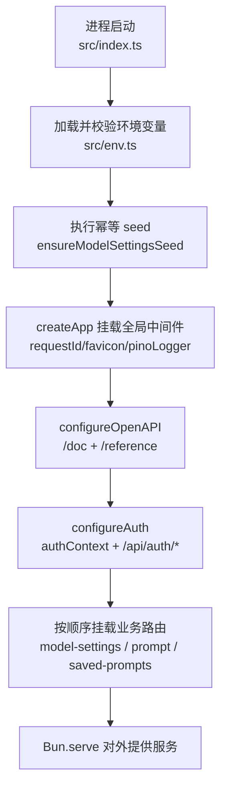
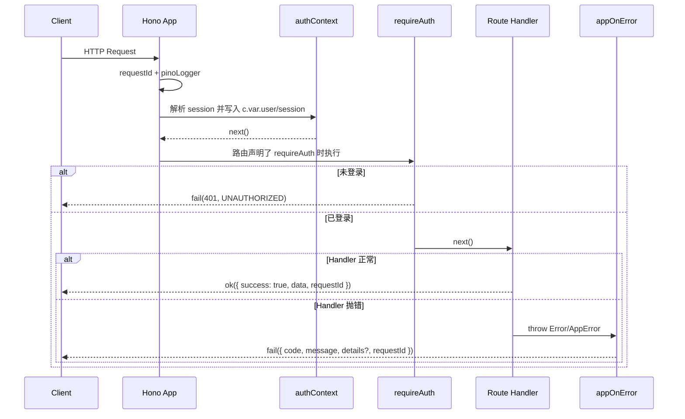
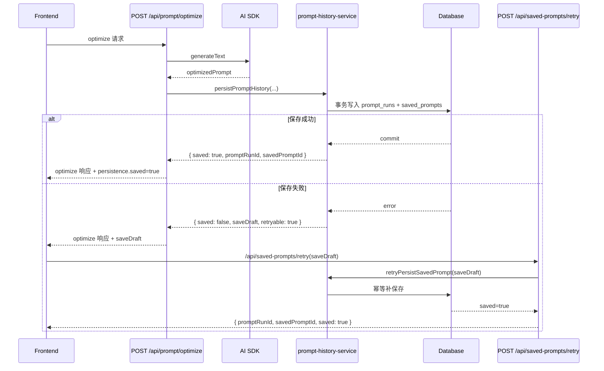

# 后端流程总览

## 1. 文档目标与阅读方式

- 目标：帮助后续开发者在 30 分钟内建立对后端项目的整体认知，能快速定位入口文件与关键流程。
- 适用人群：首次接手 `apps/backend` 的开发者。
- 推荐阅读顺序：
  1. 系统入口与目录地图
  2. 请求生命周期
  3. 核心业务流程
  4. 开发改动指南与排查入口
- 更新原则：本文档以当前代码为准；路由、中间件、schema、错误码发生变更时必须同步更新。

## 2. 系统入口与目录地图

### 2.1 启动入口链路

从启动到路由可用的主链路如下：

1. `apps/backend/src/index.ts`
2. `apps/backend/src/app.ts`
3. `apps/backend/src/lib/app/create-app.ts`
4. `apps/backend/src/lib/openapi/configure.ts`
5. `apps/backend/src/lib/auth/configure.ts`
6. `apps/backend/src/routes/index.ts`

### 2.2 关键目录职责

| 路径 | 作用 |
| --- | --- |
| `apps/backend/src/routes/` | 按业务模块组织 OpenAPI 路由定义、handler、测试 |
| `apps/backend/src/lib/` | 跨模块复用能力（AI、错误码、OpenAPI 辅助、业务 service 等） |
| `apps/backend/src/db/` | Drizzle schema、migration、seed、数据库初始化 |
| `apps/backend/src/middlewares/` | 请求日志、鉴权上下文、路由鉴权、全局错误处理 |
| `apps/backend/src/env.ts` | 环境变量加载与校验（启动时强约束） |

## 3. 启动流程（Mermaid Flowchart）

对应源码：`src/index.ts`、`src/app.ts`、`src/lib/app/create-app.ts`、`src/lib/openapi/configure.ts`、`src/lib/auth/configure.ts`、`src/routes/index.ts`

## 4. 请求生命周期（Mermaid Sequence）

对应源码：`src/lib/app/create-app.ts`、`src/lib/auth/configure.ts`、`src/middlewares/auth-context.ts`、`src/middlewares/require-permission.ts`、`src/lib/utils/http.ts`、`src/middlewares/app-on-error.ts`

响应规范（统一）：

- 成功：`{ success: true, data, requestId? }`
- 失败：`{ success: false, error: { code, message, details? }, requestId? }`

## 5. 核心业务流程

### 5.1 模型设置流程（ModelSettings）

对应源码：`src/routes/model-settings/*`、`src/lib/ai/model-resolver.ts`、`src/lib/ai/provider-key-crypto.ts`

主流程：

1. 查询服务商与模型：`GET /api/providers`
2. 新建兼容服务商：`POST /api/providers/openai-compatible`
3. 更新服务商配置/启停：`PUT /api/providers/{providerId}`
4. 手动同步模型：`POST /api/providers/{providerId}/models/sync`
5. 手动新增模型：`POST /api/models`
6. 更新模型配置/启停：`PUT /api/models/{modelId}`
7. 读取与更新默认模型：`GET/PUT /api/model-defaults`

关键规则：

- provider/model 禁用前会校验是否被默认模型引用。
- provider `apiKey` 密文存储并脱敏返回。
- 默认模型在运行时会校验“模型存在 + 模型启用 + provider 启用 + provider 已配置密钥”。

### 5.2 Prompt 运行流程（PromptRuntime）

对应源码：`src/routes/prompt/*`、`src/lib/ai/model-resolver.ts`、`src/lib/ai/provider-factory.ts`

主流程：

1. `POST /api/prompt/evaluate`
   - 解析运行模型（显式 `modelId` 优先，否则回退默认评估模型）
   - 组装评估 prompt 并调用 AI SDK
2. `POST /api/prompt/optimize`
   - 解析运行模型（显式 `modelId` 优先，否则回退默认优化模型）
   - 组装优化 prompt 并调用 AI SDK
   - 优化成功后进入保存流程（见 5.3）

### 5.3 优化保存流程（Prompt History + Saved Prompts）

对应源码：`src/routes/prompt/prompt.handlers.ts`、`src/lib/prompt/prompt-history-service.ts`、`src/routes/saved-prompts/*`、`src/lib/ai/save-draft-signing.ts`

## 6. 数据流与存储模型速查

对应源码：`src/db/schemas/*.ts`、`src/db/migrations/*.sql`

| 表名 | 在流程中的角色 | 关键关联 |
| --- | --- | --- |
| `ai_providers` | 服务商配置与启停状态 | `ai_models.provider_id -> ai_providers.id` |
| `ai_models` | 可选模型与启停状态 | 被 `ai_model_defaults`、`prompt_runs` 引用 |
| `ai_model_defaults` | 评估/优化默认模型配置（单例） | `evaluate_model_id`、`optimize_model_id` 指向 `ai_models` |
| `prompt_runs` | 一次优化任务的完整运行记录 | `optimize_model_id` 必填；`evaluate_model_id` 可空 |
| `saved_prompts` | 面向保存页面的优化结果清单 | `prompt_run_id` 唯一关联 `prompt_runs` |

数据流要点：

1. 运行时先读 provider/model/defaults（模型解析）。
2. 优化成功后写 `prompt_runs` + `saved_prompts`（同事务）。
3. 保存页面仅读 `saved_prompts`，不直接暴露原始提示词正文。

## 7. 接口总览（按模块）

对应源码：`src/routes/*/*.routes.ts`

### 7.1 ModelSettings（要求登录态）

- `GET /api/providers`
- `POST /api/providers/openai-compatible`
- `PUT /api/providers/{providerId}`
- `POST /api/providers/{providerId}/models/sync`
- `POST /api/models`
- `PUT /api/models/{modelId}`
- `GET /api/model-defaults`
- `PUT /api/model-defaults`

### 7.2 PromptRuntime（要求登录态）

- `POST /api/prompt/evaluate`
- `POST /api/prompt/optimize`

### 7.3 SavedPrompts（要求登录态）

- `GET /api/saved-prompts`
- `POST /api/saved-prompts/retry`

### 7.4 OpenAPI/Auth（无需业务登录态）

- `GET /doc`
- `GET /reference`
- `GET|POST /api/auth/*`

## 8. 开发改动指南（最小可执行）

### 8.1 新增后端能力推荐路径

`routes/*.routes.ts -> routes/*.handlers.ts -> lib service(有复用时) -> db schema/migration -> tests`

### 8.2 常用命令

- `bun run dev:backend`
- `bun run --filter backend test`
- `bun run db:generate`
- `bun run db:migrate`
- `bun run db:check`

### 8.3 典型改动示例

示例 A：新增一个受保护接口

1. 在模块 `*.routes.ts` 增加 `createRoute`，挂 `middleware: [requireAuth()]`
2. 在 `*.handlers.ts` 实现业务逻辑并使用 `ok/fail`
3. 在 `*.index.ts` 挂载 `router.openapi(...)`
4. 在 `routes/index.ts` 注册模块（若是新模块）
5. 补充 `*.test.ts`（至少覆盖未登录拒绝 + 成功路径）

示例 B：新增持久化字段

1. 修改 `src/db/schemas/*.ts`
2. 生成 migration：`bun run db:generate`
3. 更新相关 handler/service 的读写逻辑
4. 更新路由 schema（请求/响应）
5. 更新测试与相关文档

## 9. 常见排查入口

| 现象 | 优先检查文件 | 常见错误码/原因 |
| --- | --- | --- |
| 接口总是 401 | `middlewares/auth-context.ts`、`middlewares/require-permission.ts`、`lib/auth/instance.ts` | `40101`，会话未写入或无效 |
| evaluate/optimize 返回模型不可用 | `lib/ai/model-resolver.ts`、`routes/model-settings/*` | `22001/22002/22003/22004/22005` |
| optimize 成功但未保存 | `lib/prompt/prompt-history-service.ts`、`routes/prompt/prompt.handlers.ts` | `persistence.saved=false`，需走 retry |
| retry 返回 422 | `lib/ai/save-draft-signing.ts` | `32101`，草稿签名无效或过期 |
| saved-prompts 分页异常 | `lib/prompt/prompt-history-service.ts` | cursor 格式无效（422） |
| 错误码与 HTTP 状态不一致 | `middlewares/app-on-error.ts`、`lib/errors/codes.ts` | 全局错误映射逻辑问题 |

## 10. 相关文档链接

- `docs/requirements.md`
- `docs/model-settings-implementation.md`
- `docs/prompt-history-implementation.md`

## 更新触发条件

出现以下任一变更时，需要同步更新本文档：

1. `src/routes/**/*.routes.ts` 路径、方法或鉴权策略变化。
2. `src/lib/app/create-app.ts`、`src/app.ts`、`src/index.ts` 启动链路变化。
3. `src/middlewares/*` 请求处理顺序或错误处理策略变化。
4. `src/db/schemas/*` 新增/删除表或关键关系变化。
5. `src/lib/prompt/*` 或 `src/lib/ai/save-draft-signing.ts` 的保存流程规则变化。
